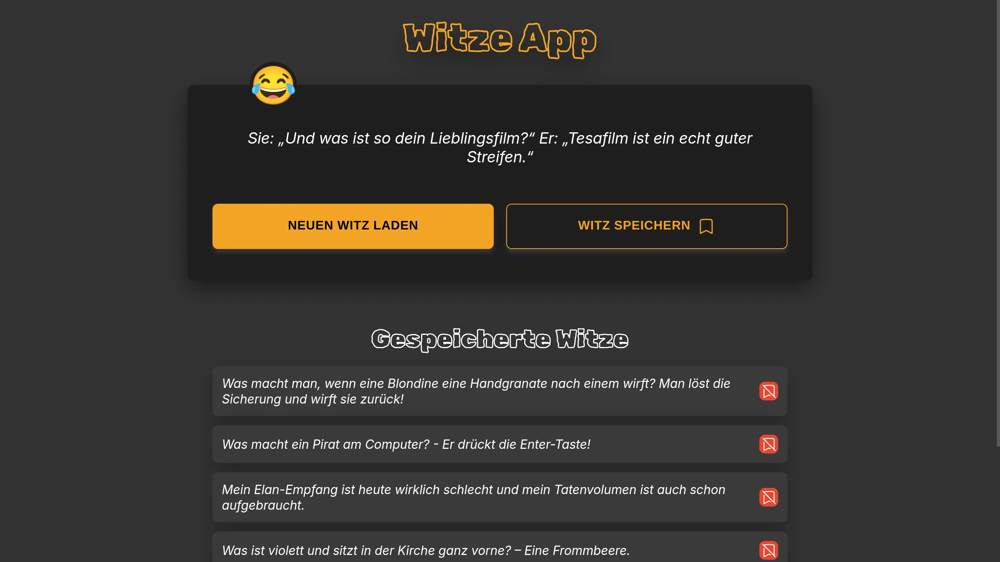

# 🎭 Witze-App (Joke Generator)

Ein interaktives Web-Projekt, das zeigt, wie moderne Web-Technologien (Vite, Sass, REST-APIs) genutzt werden, um eine performante und benutzerfreundliche Anwendung zu erstellen.

[](https://frederikanspach.github.io/witze-app/)

<picture>
  <source media="(prefers-color-scheme: dark)" srcset="img/screenshot-02.webp">
  <source media="(prefers-color-scheme: light)" srcset="img/screenshot-01.webp">
  
</picture>

## 🚀 Das Projekt

Diese Anwendung ruft dynamisch Witze von einer externen REST-API ab. Der Fokus lag auf einer sauberen Trennung von Logik und Design sowie der Nutzung moderner Build-Tools für eine optimale Performance.

### 🛠 Tech-Stack

- **Frontend:** HTML5, SCSS (Sass)
- **Logik:** JavaScript (ES6+ Module)
- **Build-Tool:** **Vite** (für schnelles Development und optimierte Bundles)
- **API:** Fetch API für asynchronen Datenabruf
- **Workflow:** Eigene Bash-Skripte zur automatisierten WebP-Konvertierung und Asset-Optimierung

### ✨ Key Features

- **Asynchroner Datenabruf:** Effiziente Nutzung von `async/await` für eine flüssige User Experience.
- **Theme-Support:** Vollständig optimiert für Light- und Dark-Mode (wird automatisch basierend auf den Systemeinstellungen angezeigt).
- **Responsive Design:** Dank SCSS-Struktur nahtlose Darstellung auf Desktop- und Mobilgeräten.
- **Performance:** Optimierte Ladezeiten durch WebP-Assets und Vite-Bundling.

## 💡 Learning Outcomes

In diesem Projekt habe ich den professionellen Umgang mit **Vite** und **Sass** vertieft. Eine besondere Herausforderung war das Handling von API-Ladezuständen (Loading States) und Fehlern, um die UI stets stabil zu halten. Zudem habe ich automatisierte Workflows (Bash-Skripte) integriert, um die Asset-Pipeline effizient zu gestalten.

## 🛠 Installation & Start

Um das Projekt lokal zu bearbeiten, benötigst du [Node.js](https://nodejs.org/).

1. **Repository klonen:**
   ```bash
   git clone [https://github.com/frederikanspach/witze-app.git](https://github.com/frederikanspach/witze-app.git)
   cd witze-app
   ```
